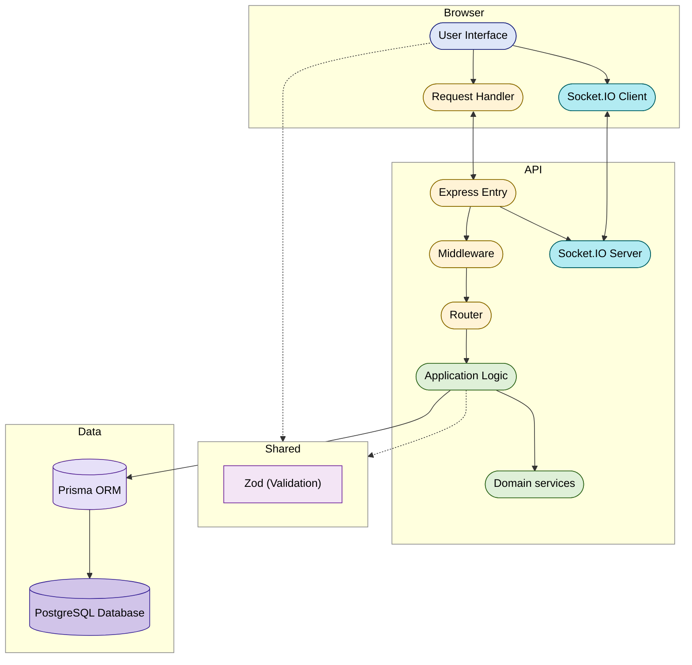

# ShiftSync — Assessment Documentation

This document provides:

- **Login details** for each role  
- **Known limitations**  
- **Explicit assumptions** made where requirements were ambiguous

The goal is to clearly communicate how the system behaves, especially in **edge cases and real-world scenarios**.

---

## Submission Links

| Deliverable         | URL                                                                                                                |
| ------------------- | ------------------------------------------------------------------------------------------------------------------ |
| Working application | [https://sharesync-ass.netlify.app/](https://sharesync-ass.netlify.app/)                                           |
| Source repository   | [https://github.com/Jahsminemma/priority-soft-assessment](https://github.com/Jahsminemma/priority-soft-assessment) |

The hosted app connects to a **deployed API and database**, and **demo accounts are pre-seeded**.

---

## How to Log In (by Role)

**Password (all accounts):**  
`password123`

| Role        | Email                      | What to Try                                                                                             |
| ----------- | -------------------------- | ------------------------------------------------------------------------------------------------------- |
| **Admin**   | `admin@coastaleats.test`   | All locations, **global audit trail + CSV export**, team/invites, analytics                             |
| **Manager** | `manager@coastaleats.test` | Multi-location scheduling, **coverage queue**, clock verification, analytics, **shift History (audit)** |
| **Staff**   | `sam@coastaleats.test`     | Pending **swap request**, multi-location assignments                                                    |
|             | `jordan@coastaleats.test`  | Premium shift (swap target), multi-skill                                                                |
|             | `casey@coastaleats.test`   | **Overtime-heavy schedule** for analytics demo                                                          |
|             | `riley@coastaleats.test`   | Single-location bartender                                                                               |
|             | `jamie@coastaleats.test`   | **Overlap, 10h rest, long shift constraints**                                                           |
|             | `pat@coastaleats.test`     | **Not certified** edge case (Boston)                                                                    |
|             | `quinn@coastaleats.test`   | **Split shifts** (daily-hour warning)                                                                   |
|             | `taylor@coastaleats.test`  | Overnight + drop request + daily warning                                                                |
|             | `drew@coastaleats.test`    | Understaffed shift scenario                                                                             |
|             | `eve@coastaleats.test`     | **Availability violation (weekday block)**                                                              |

---

## Architecture (high level)

The system is a **monorepo**: shared TypeScript package for **API contracts and pure helpers**, a **stateless API** (plus websocket attachment) backed by **PostgreSQL**, and a **static SPA** that calls REST and opens a Socket.IO connection.

## What I Implemented 

- **Auth & Roles**: JWT-based authentication with **ADMIN / MANAGER / STAFF** roles and location-scoped access  
- **Scheduling**: Shift creation, assignment, publish/unpublish with **48-hour cutoff** and emergency override  
- **Constraints Enforcement**:
  - Skill matching  
  - Location certification  
  - Availability windows + exceptions  
  - No double-booking  
  - Minimum **10-hour rest** between shifts  
  - Daily limits (warnings at 8h, hard block at 12h)  
  - Weekly overtime warnings (**35h / 40h**)  
  - **6th / 7th consecutive day rules** (7th requires override)
- **Overtime Projection**:
  - FIFO allocation of **40h straight-time → overtime at 1.5×**  
  - Real-time preview of overtime impact per assignment
- **Coverage Flows**:
  - Swap requests  
  - Drop (callout) handling  
  - Open shifts with manager approval flow
- **Realtime Updates**:
  - Socket-based updates for schedules, coverage, notifications, and conflicts
- **Notifications**:
  - In-app notifications with optional simulated email
- **Analytics**:
  - Fairness vs desired hours  
  - Premium shift distribution  
  - Overtime visibility
- **Audit Trail**:
  - Per-shift **timeline history** (who, when, before/after)  
  - Global audit logs + CSV export (admin only)
- **Clock System**:
  - Clock in/out with verification codes and manager approval

---

## Known Limitations

- **No real email integration**  
Email is simulated via stored notification metadata and development logs.
- **Overtime and fairness are projections only**  
These are for scheduling visibility and not payroll/legal guarantees.
- **Audit scope differences**  
  - Admins: full global logs + export  
  - Managers: shift-level history only
- **Limited automated testing**  
Focus is on domain logic and services; no full end-to-end test suite.

---

## Assumptions (Ambiguous Requirements)

Where the product brief left behavior unspecified, the implementation follows the rules below. They are enforced in **backend validation** (source of truth) and reflected in the **UI** (warnings, errors, and required fields).

---

### Coverage — drops (callouts), swaps, and manager queue

**Drops vs swaps**  
- A **DROP** is “I cannot work this shift” (callout).  
- A **SWAP** is a peer-to-peer trade (one-way or two-way). Swaps create **pending** coverage requests and notify managers; they do **not** use the same OPEN/DIRECTED broadcast rule as drops.

**OPEN vs DIRECTED (DROP only)**  
When a staff member requests a drop, the system sets `calloutMode` from **time until shift start**:

| Condition | Mode | Meaning |
| --- | --- | --- |
| Shift **has not started** and starts in **≤ 1 hour** | `OPEN` | Eligible staff at that location (skill + certification, excluding the requester) get a **broadcast** notification. |
| Otherwise (more than 1 hour away, or already started) | `DIRECTED` | No staff broadcast; **managers** assign a replacement through the coverage flow. |

- The rule is based only on **milliseconds until `startAtUtc`** — not on weekday, season, or location-specific “policy days.”

**DROP expiry (`expiresAt`)**  
The request auto-expires at a computed time so stale callouts do not linger:

1. If **24 hours before shift start** is still **in the future**, that instant is used (typical for early callouts).  
2. Otherwise (late callout), expiry is **`min( shift start, max( one minute before shift start, now + 30 seconds ) )`** — i.e. at least **30 seconds** from creation, never **after** the shift starts, and (when the math allows) not **before** one minute prior to start.

Stale `PENDING` DROP rows are cleaned up when coverage endpoints run (`expireStaleCoverageRequests`).

**Who can fill the shift**  
- **OPEN**: A staff member may **claim** the open drop (recorded as pending); a **manager must approve** before the assignment moves.  
- **DIRECTED**: Replacement is **manager/admin driven** (direct assignment / finalize with target), not a free-for-all claim by any staff.

**Limits**  
- A user may have at most **3** open swap or drop requests in a “waiting” state (coworker or manager), to keep the queue manageable.

---

### Schedule cutoff (published weeks)

**Default**  
- **`cutoffHours`** defaults to **48** per published schedule week (stored on the schedule-week row; seed uses 48).

**What “inside the cutoff” means**  
- For a given shift, the edit window closes when **now ≥ shift start − cutoffHours** (UTC timestamps).  
- For **week-level** actions (e.g. whether **any** shift in the week is “locked”), the same rule applies **per shift**; if **any** shift in that ISO week crosses the threshold, manager-only actions may require an **emergency override**.

**Managers vs admins**  
- **Managers** past cutoff must supply a valid **`emergencyOverrideReason`** (trimmed length **≥ 10**) on the relevant API calls (assignments, unpublish, etc.), unless the product allows another path (e.g. coverage notifications as documented in errors).  
- **Admins** are not subject to the manager cutoff gate for those operations.

**Publishing**  
- Publishing stores the cutoff hours for that week; the UI and API use it consistently for lock detection.

---

### Time, timezones, and “weeks”

- **Location timezone** (`tzIana`) drives: shift display, “which calendar day” a shift belongs to, daily hour totals, and weekly buckets. Calculations use **Luxon** with explicit zones rather than naive local strings.  
- **Overnight shifts** are one shift record; hours can **split across local calendar days** for **daily** limits (segments per local midnight).  
- **Weekly** overtime and warnings use the **ISO week** (Monday start) in the **location** timezone for the anchor shift.  
- **Database / API** times are stored in **UTC**; the UI converts for display.

---

### Overtime and weekly hour warnings (projection)

- **Straight time** is capped at **40 hours** per ISO week (per location week model used in constraints).  
- Hours beyond 40 are treated as **overtime** at **1.5×** for **cost projection** (not a payroll system).  
- **FIFO by shift start time** (earlier shifts consume the 40h bucket first); later shifts push incremental hours into OT in previews.  
- **Warnings** (not hard blocks): **35h+** and **40h+** weekly thresholds (`WEEKLY_WARN_35`, `WEEKLY_WARN_40`) to surface risk before assignment commit.

---

### Consecutive work days and the 7th day

- **Consecutive days** are **calendar days** in the **location timezone** where the staff member has **any** work (including partial days from overnight splits). **Hours do not matter** — a short shift counts the same as a long one for this streak.  
- The streak is computed **within the ISO week** that contains the **proposed shift’s start** (same week window used for other weekly rules): we take all calendar days that have shift time in that week, sort them, and take the **longest run** of consecutive dates.  
- **6th consecutive day** → **warning** (`CONSECUTIVE_SIXTH_DAY`).  
- **7th consecutive day** → **hard block** unless **`seventhDayOverrideReason`** is provided (manager-documented); when allowed, a **warning** confirms the override is **stored on assignment audit** (and visible in shift history / admin tooling as implemented).

---

### Concurrency and duplicate submits

- **Assignment commits** use a **Prisma transaction** with isolation level **`Serializable`** so concurrent assigns cannot oversubscribe headcount or double-book the same user in ways the constraints prevent.  
- Clients send an **`idempotencyKey`** (shared schema: min 8, max 128 chars). The server **persists** the first successful result for that key; **retries with the same key** return the **same outcome** instead of creating duplicate rows.  
- If two different clients race legitimately, one may **fail** (e.g. conflict or constraint); the user can **retry** with a new key after fixing state.

---

### Notifications and “email”

- There is **no** external SMTP/SendGrid/etc. integration.  
- **In-app** notifications are first-class.  
- **Email** is **simulated**: payloads can include email-like metadata for demos, and in development, relevant details may be **logged** for inspection — not delivered to real inboxes.

---

## Notes

These rules are applied **consistently** in domain logic (`backend/src/domain/…`), application services, and API routes, with the SPA surfacing validation messages and required fields. If something in the brief could be read two ways, the behavior above is the one the code implements.