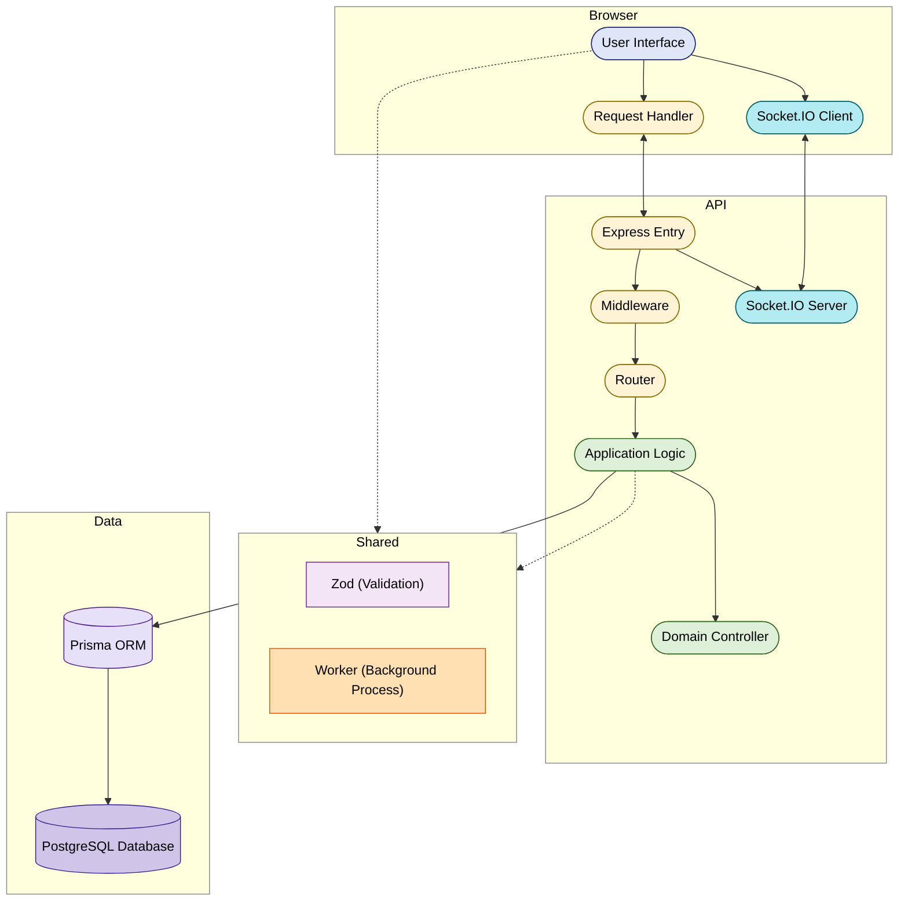

# ShiftSync — assessment documentation

This document satisfies the **brief documentation** deliverable: how to sign in, what the system does, **known limitations**, **assumptions** where requirements were ambiguous, and an **architecture overview** with a diagram.

## Submission links

| Deliverable         | URL                                                                                                                |
| ------------------- | ------------------------------------------------------------------------------------------------------------------ |
| Working application | [https://sharesync-ass.netlify.app/](https://sharesync-ass.netlify.app/)                                           |
| Source repository   | [https://github.com/Jahsminemma/priority-soft-assessment](https://github.com/Jahsminemma/priority-soft-assessment) |

The hosted app talks to a **deployed API and database** and Demo accounts exist  

---

## How to log in (by role)

Password for every seeded account: 

### Password: password123.

| Role        | Email                      | What to try in the app                                                                                                      |
| ----------- | -------------------------- | --------------------------------------------------------------------------------------------------------------------------- |
| **Admin**   | `admin@coastaleats.test`   | All locations, **Audit trail** (global logs + CSV export), team/invites, full analytics.                                    |
| **Manager** | `manager@coastaleats.test` | **SF, LA, NYC, Boston** — schedule, coverage queue, clock verification, analytics, shift **History** tab (per-shift audit). |
| **Staff**   | `sam@coastaleats.test`     | Server; SF + NYC + Boston certs; Tue partial shift; **pending swap** with Jordan.                                           |
|             | `jordan@coastaleats.test`  | Server + bartender; SF + NYC + Boston; Fri premium bar (swap target).                                                       |
|             | `casey@coastaleats.test`   | Server; **LA only** — heavy week for **overtime / analytics** demos.                                                        |
|             | `riley@coastaleats.test`   | Bartender; LA only.                                                                                                         |
|             | `jamie@coastaleats.test`   | Server; multi-site — seeded **overlap**, **10h rest**, and **long Saturday** constraint demos.                              |
|             | `pat@coastaleats.test`     | Bartender; SF + LA + NYC (no Boston) — use for **NOT_CERTIFIED** on Boston open bar shift.                                  |
|             | `quinn@coastaleats.test`   | Host; Mon NYC **split shifts** — preview second shift for **daily-hour warning**.                                           |
|             | `taylor@coastaleats.test`  | Server + bartender; SF overnight Fri→Sat; Wed drop; Boston Mon **A** assigned — preview **B** for daily warning.            |
|             | `drew@coastaleats.test`    | Line cook; LA Thu understaffed shift.                                                                                       |
|             | `eve@coastaleats.test`     | Server; SF only; **weekend-only** availability (weekday assign → hard block).                                               |

---

## What I implemented (feature summary)

- **Auth**: JWT login; **ADMIN / MANAGER / STAFF** with location-scoped managers (`ManagerLocation`).
- **Schedule**: Shifts (draft/published, premium, headcount), **schedule week** publish/unpublish, **edit cutoff** (default 48h) with **emergency override** reason where supported.
- **Assignments**: Server-side **preview** and **commit**; **idempotency key** on commit; conflict handling + realtime **assignment conflict** signal.
- **Constraints** (enforced on server, surfaced in UI): missing skill, **not certified** to location, availability rules + **unavailability exceptions**, **double-book**, **rest under 10 hours** between shifts, **daily** hard cap (e.g. 12h) and **warnings** (e.g. over 8h in a day), **weekly overtime** threshold warnings (35h / 40h), **6th / 7th consecutive day** (7th requires documented override on commit).
- **Labor projection**: **40 hours straight-time** per ISO week, then **1.5× the regular rate** for **overtime** minutes; **first-in-first-out** ordering by **shift start time** (earlier shifts use straight time first; tie-break by assignment id); **per-assignment preview** labor delta; **Analytics** + **Manager home** projected **overtime** payroll and **assignments that drive the most overtime cost**.
- **Coverage**: Swap and drop requests, **open callout**, manager approval flows; notifications for participants.
- **Realtime**: **Socket.IO** (JWT on connect); the app shell runs `**useSocketSync`**, which **invalidates/refetches** schedules, coverage queues, notifications, and on-duty presence when the server emits events.
- **Notifications**: In-app list; **Settings** toggles; **email simulated** path (no SMTP — payload stamp + dev log in non-production).
- **Staff**: My week, shift detail, **availability** rules + batch/single exceptions (managers notified on change).
- **Clock**: Clock in/out; **verification code** shown to staff, manager preview/approve (role- and location-aware).
- **Analytics**: Fairness vs **desired hours**, premium distribution, overtime views (by location or all for admin).
- **Audit**: **Per-shift history** (managers + admins on shifts they can manage); **global audit trail + CSV export** (admins only). Assignment audit stores **7th-day override** text when used.
- **Registration**: Invite-based registration route (admin-created invites).
- **Seed data**: Four locations (two US time zones), multiple skills, realistic week with **per-location** constraint and **overtime** showcase (see below).

---

## Architecture (high level)

The system is a **monorepo**: shared TypeScript package for **API contracts and pure helpers**, a **stateless API** (plus websocket attachment) backed by **PostgreSQL**, and a **static SPA** that calls REST and opens a Socket.IO connection.

**Why this shape:** Shared Zod keeps **one contract** for validation and typing across UI and API. **Domain logic stays free of HTTP** so constraints and **overtime / first-in-first-out labor** logic are unit-tested without a server. **Socket.IO** is attached to the same process as Express so broadcast and REST share auth and services.

---

## Known limitations

- **No real email**: “Email” is **simulated** (metadata on notification JSON + optional server log in development). There is no SMTP provider integration.
- **Overtime and fairness are projections** for scheduling visibility, not legal or payroll guarantees.
- **Global audit listing and CSV export** are **admin-only**. Managers see **shift-scoped** history in the schedule UI (by design, to match scoped responsibility).
- **Automated tests** focus on **domain** and selected services; there is no full end-to-end test.

---

## Assumptions and explicit product rules

Where requirements were silent or fuzzy, I **encoded specific rules in code**. The list below matches the implementation (see especially `backend/src/application/coverage/coverage.service.ts`, `shifts/shift.service.ts`, `assignments/assignment.service.ts`, `domain/scheduling/constraints.ts`, `clock/clock.service.ts`).

### Coverage — DROP (“callout”) and the one-hour rule

- **OPEN vs DIRECTED:** When staff create a **DROP** request, the server sets `calloutMode` to **OPEN** only if the shift **has not started yet** and starts in **one hour or less**.
- If the shift is **more than one hour away**, or **already started**, the drop is **DIRECTED** (manager-driven reassignment path; no broadcast fan-out to eligible staff.
- **Not weekend-specific:** The threshold is **only** how long until this shift starts, not the day of week. A Wednesday shift one hour out behaves the same as a Saturday shift one hour out.
- **Offer expiry:** if **24 hours before** shift start is still in the future, use that; otherwise clamp between **30 seconds from now** and **one minute before** shift start (never after start). Stale pending DROPs flip to **EXPIRED** via `expireStaleCoverageRequests`.
- **OPEN claim path:** Volunteers who claim go through **manager approval** before the assignment moves off the original requester.

### Schedule edits — cutoff and emergency override

- Each `ScheduleWeek` has `cutoffHours` (default **48** in seed). Inside that window before a shift, managers need an `emergency Override Reason` of at least **10 characters** on supported operations, or an **admin** must act.

### Swaps

- **SWAP** requests notify managers; two-location swaps notify managers for **both** sites when the peer shift is at another location.

### Clock-in verification

- Staff-facing verification codes expire after **15 minutes**.

### Time, zones, and weeks

- UI and constraints use each location’s `**tzIana`**. **DST** follows Luxon for that zone. **Overnight** shifts are one row crossing local midnight (split into local-day segments for daily rules).
- **ISO week** `weekKey` (Monday start). Each site has its own `ScheduleWeek` with `weekStartDateLocal` in **that** zone; Pacific vs Eastern can disagree on the calendar date of “Monday of the same ISO week” near boundaries — **per-location rows are authoritative**.

### Overtime (projection only)

- **Overtime** here means minutes worked beyond **40 hours of straight time** in the ISO week (using the location-week model in constraints). Those minutes are costed at **1.5 times** the applicable hourly rate.
- **First-in-first-out** means straight-time minutes are **consumed in order of shift start time**: shifts that **start earlier** in the week use the 40-hour allowance first; minutes on **later-starting** shifts spill into **overtime** first. If two shifts share the same start instant, **assignment id** breaks the tie.
- Wage: `User.hourlyRate` or `Location.defaultHourlyRate`. This is for **scheduling visibility**, not payroll compliance.

### Seventh consecutive work day

- A **7th** consecutive work day in the week is **blocked** unless the manager supplies a documented **`seventhDayOverrideReason`** on commit; that text is stored on the assignment audit trail.

### Notifications

- **No SMTP.** Optional **simulated email** only enriches the stored notification JSON (and dev logs in non-production).

### Concurrent assignment commits

- Clients send an **idempotency key** on commit; the API returns the prior result when the key repeats. Duplicate `(shiftId, staffUserId)` rows still surface as **P2002** with a realtime conflict hint.
- **Assignment commit** runs in a **Serializable** database transaction: it **re-checks headcount** and **rebuilds constraint context** (including other assignments) on the same connection, then inserts. If two managers race, PostgreSQL may abort one transaction (**P2034**); the API responds with a **conflict** and asks the user to refresh—reducing double-book and over-headcount races that a pure “check then insert” flow would allow.

---

