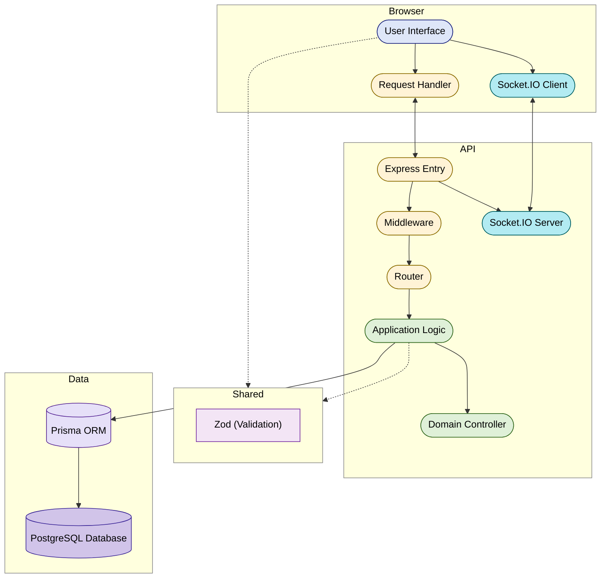

# ShiftSync — Assessment Documentation

This document provides:

- **Login details** for each role  
- **Known limitations**  
- **Explicit assumptions** made where requirements were ambiguous

The goal is to clearly communicate how the system behaves, especially in **edge cases and real-world scenarios**.

---

## Submission Links

| Deliverable         | URL                                                                                                                |
| ------------------- | ------------------------------------------------------------------------------------------------------------------ |
| Working application | [https://sharesync-ass.netlify.app/](https://sharesync-ass.netlify.app/)                                           |
| Source repository   | [https://github.com/Jahsminemma/priority-soft-assessment](https://github.com/Jahsminemma/priority-soft-assessment) |

The hosted app connects to a **deployed API and database**, and **demo accounts are pre-seeded**.

---

## How to Log In (by Role)

**Password (all accounts):**  
`password123`

| Role        | Email                      | What to Try                                                                                             |
| ----------- | -------------------------- | ------------------------------------------------------------------------------------------------------- |
| **Admin**   | `admin@coastaleats.test`   | All locations, **global audit trail + CSV export**, team/invites, analytics                             |
| **Manager** | `manager@coastaleats.test` | Multi-location scheduling, **coverage queue**, clock verification, analytics, **shift History (audit)** |
| **Staff**   | `sam@coastaleats.test`     | Pending **swap request**, multi-location assignments                                                    |
|             | `jordan@coastaleats.test`  | Premium shift (swap target), multi-skill                                                                |
|             | `casey@coastaleats.test`   | **Overtime-heavy schedule** for analytics demo                                                          |
|             | `riley@coastaleats.test`   | Single-location bartender                                                                               |
|             | `jamie@coastaleats.test`   | **Overlap, 10h rest, long shift constraints**                                                           |
|             | `pat@coastaleats.test`     | **Not certified** edge case (Boston)                                                                    |
|             | `quinn@coastaleats.test`   | **Split shifts** (daily-hour warning)                                                                   |
|             | `taylor@coastaleats.test`  | Overnight + drop request + daily warning                                                                |
|             | `drew@coastaleats.test`    | Understaffed shift scenario                                                                             |
|             | `eve@coastaleats.test`     | **Availability violation (weekday block)**                                                              |

---

## Architecture (high level)

The system is a **monorepo**: shared TypeScript package for **API contracts and pure helpers**, a **stateless API** (plus websocket attachment) backed by **PostgreSQL**, and a **static SPA** that calls REST and opens a Socket.IO connection.

## What I Implemented 

- **Auth & Roles**: JWT-based authentication with **ADMIN / MANAGER / STAFF** roles and location-scoped access  
- **Scheduling**: Shift creation, assignment, publish/unpublish with **48-hour cutoff** and emergency override  
- **Constraints Enforcement**:
  - Skill matching  
  - Location certification  
  - Availability windows + exceptions  
  - No double-booking  
  - Minimum **10-hour rest** between shifts  
  - Daily limits (warnings at 8h, hard block at 12h)  
  - Weekly overtime warnings (**35h / 40h**)  
  - **6th / 7th consecutive day rules** (7th requires override)
- **Overtime Projection**:
  - FIFO allocation of **40h straight-time → overtime at 1.5×**  
  - Real-time preview of overtime impact per assignment
- **Coverage Flows**:
  - Swap requests  
  - Drop (callout) handling  
  - Open shifts with manager approval flow
- **Realtime Updates**:
  - Socket-based updates for schedules, coverage, notifications, and conflicts
- **Notifications**:
  - In-app notifications with optional simulated email
- **Analytics**:
  - Fairness vs desired hours  
  - Premium shift distribution  
  - Overtime visibility
- **Audit Trail**:
  - Per-shift **timeline history** (who, when, before/after)  
  - Global audit logs + CSV export (admin only)
- **Clock System**:
  - Clock in/out with verification codes and manager approval

---

## Known Limitations

- **No real email integration**  
Email is simulated via stored notification metadata and development logs.
- **Overtime and fairness are projections only**  
These are for scheduling visibility and not payroll/legal guarantees.
- **Audit scope differences**  
  - Admins: full global logs + export  
  - Managers: shift-level history only
- **Limited automated testing**  
Focus is on domain logic and services; no full end-to-end test suite.

---

## Assumptions (Ambiguous Requirements)

The following rules were defined to resolve unspecified behaviors in the brief:

### Coverage (Callout / Drop Logic)

- **OPEN vs DIRECTED**:
  - OPEN only if shift starts within **1 hour and hasn’t started**
  - Otherwise DIRECTED (manager-controlled)
- **Not day-dependent**:
  - Based strictly on **time-to-shift**, not weekday/weekend
- **Expiry logic**:
  - Default: 24 hours before shift  
  - Otherwise clamped between:
    - ≥ 30 seconds from now  
    - ≤ 1 minute before shift start
- **Pickup flow**:
  - Staff claims require **manager approval**

---

### Schedule Cutoff

- Default **48-hour cutoff**
- Inside cutoff:
  - Requires **override reason (min 10 characters)** or admin action

---

### Time & Timezones

- All logic uses **location timezone (`tzIana`)**
- DST handled via timezone-aware calculations
- Overnight shifts span midnight but are treated as **single shifts**
- Weeks follow **ISO standard (Monday start)** per location

---

### Overtime Calculation

- Overtime = **hours beyond 40 per ISO week**
- Paid at **1.5× rate**
- **FIFO allocation**:
  - Earlier shifts consume regular hours first
  - Later shifts push into overtime

---

### Consecutive Days

- Based on **days worked**, not hours worked  
- A **1-hour shift counts the same as an 11-hour shift** for consecutive day tracking

---

### 7th Day Rule

- Blocked unless:
  - Manager provides **override reason**
  - Stored in audit trail

---

### Concurrency Handling

- **Idempotency keys** prevent duplicate assignments  
- **Serializable transactions** ensure:
  - No over-assignment
  - No race-condition double booking
- Conflicts:
  - One request succeeds  
  - Others fail with retry prompt

---

### Notifications

- No real email provider  
- “Email” is simulated within stored notification payloads

---

## Notes

All assumptions are **consistently enforced across backend validation and UI feedback**, ensuring predictable and transparent system behavior.